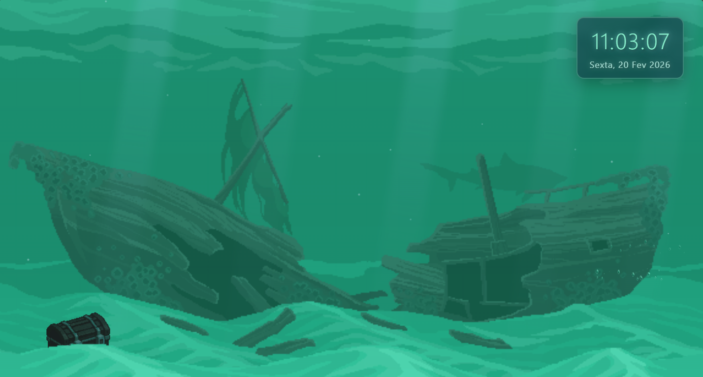

# 🌊 Sunken Ship Wallpaper

Um wallpaper dinâmico e interativo com tema subaquático, apresentando um navio afundado com animações suaves e efeitos visuais imersivos.



## ✨ Características

### Elementos Visuais
- **Camadas de Fundo Múltiplas**: Três camadas sobrepostas criando profundidade
- **Raios de Luz Dinâmicos**: Raios de luz vindos da superfície com efeito de ondulação
- **Partículas Flutuantes**: Pequenas partículas simulando sedimentos marinhos
- **Bolhas Animadas**: Bolhas com tamanhos variados subindo suavemente
- **Efeito de Água**: Ondulação e distorção simulando movimento aquático

### Personagens Animados
- **Tubarão**: Navega pela tela em um padrão de ida e volta
- **Submarino Amarelo** 🎁: Easter egg que aparece a cada 30 minutos
- **Baú do Tesouro**: Brilho dourado pulsante no fundo oceânico

### Funcionalidades
- **Relógio em Tempo Real**: Exibe hora e data atualizadas a cada segundo
- **Design Responsivo**: Ocupa 100% da tela sem margens
- **Animações Suaves**: Transições fluidas e performance otimizada
- **Estética Coesa**: Filtros aplicados para criar ambiente subaquático realista

## 🚀 Como Usar

### Instalação Local

1. Clone o repositório:
```bash
git clone https://github.com/vinicius-pascoal/sunken-ship-wallpaper.git
```

2. Navegue até o diretório:
```bash
cd sunken-ship-wallpaper
```

3. Abra o arquivo `index.html` no seu navegador preferido

### Uso como Wallpaper

Para usar como wallpaper animado no Windows:
- Utilize softwares como **Lively Wallpaper** ou **Wallpaper Engine**
- Importe o arquivo `index.html` como wallpaper local

## 📁 Estrutura do Projeto

```
sunken-ship-wallpaper/
├── index.html          # Estrutura HTML principal
├── styles.css          # Estilos e animações CSS
├── script.js           # Lógica JavaScript
└── public/
    ├── imgs/
    │   ├── assets/     # Recursos (baú, etc)
    │   ├── bolhas/     # Imagens de bolhas
    │   ├── fundo/      # Camadas de fundo (1.png, 2.png, 3.png)
    │   └── demo.png    # Screenshot de demonstração
    └── personagens/
        ├── tubarao.png
        └── yellow-submarine.png
```

## 🎨 Tecnologias Utilizadas

- **HTML5**: Estrutura semântica
- **CSS3**: Animações, gradientes e filtros avançados
- **JavaScript**: Lógica de animação e relógio dinâmico

## 🎁 Easter Eggs

- **Submarino Amarelo**: Aparece automaticamente ao carregar a página e depois a cada 30 minutos, navegando pela tela por 25 segundos

## 🎯 Funcionalidades Técnicas

### Animações CSS
- `water-wave`: Efeito de ondulação na água
- `light-shimmer`: Movimento dos raios de luz
- `float-up`: Bolhas subindo
- `swim`: Padrão de natação do tubarão
- `submarine-cruise`: Travessia do submarino
- `golden-glow`: Brilho pulsante do baú

### Performance
- Uso de `transform` e `opacity` para animações suaves
- `pointer-events: none` em elementos decorativos
- Otimização de z-index para camadas corretas
- Filtros CSS para efeitos visuais sem JavaScript pesado

## 🔧 Personalização

### Alterar Cores
Edite as variáveis de cor em `styles.css`:
- Background: `#0a1628`
- Raios de luz: `rgba(135, 206, 235, ...)`
- Relógio: `#87ebc5` e `#b0e6da`

### Alterar Velocidade das Animações
Modifique a duração nos `@keyframes` em `styles.css`:
- Tubarão: `swim 20s`
- Submarino: `submarine-cruise 25s`
- Bolhas: `float-up 8-16s` (aleatório)

### Alterar Frequência do Submarino
Edite o intervalo em `script.js`:
```javascript
setInterval(showSubmarineEasterEgg, 30 * 60 * 1000); // 30 minutos
```

## 📝 Licença

Este projeto está sob a licença MIT. Sinta-se livre para usar, modificar e distribuir.

## 👤 Autor

**Vinicius Pascoal**
- GitHub: [@vinicius-pascoal](https://github.com/vinicius-pascoal)

## 🎨 Créditos e Recursos

Os recursos visuais utilizados neste projeto foram obtidos dos seguintes sites:

- **[PixelLab.ai](https://www.pixellab.ai)** - Recursos gráficos e assets
- **[CraftPix.net](https://craftpix.net)** - Sprites e elementos visuais

---

⭐ Se você gostou deste projeto, considere dar uma estrela no repositório!
